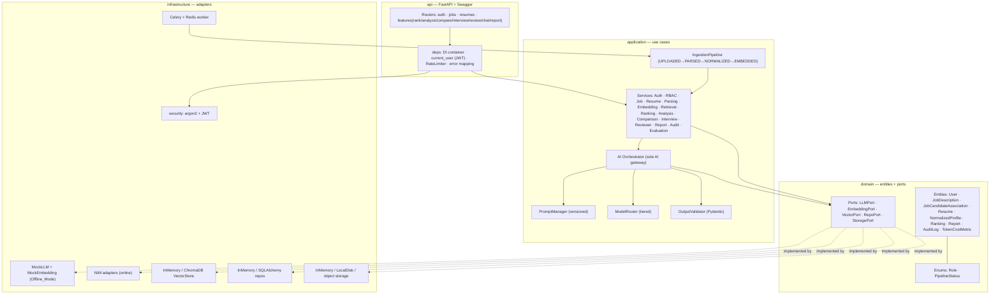
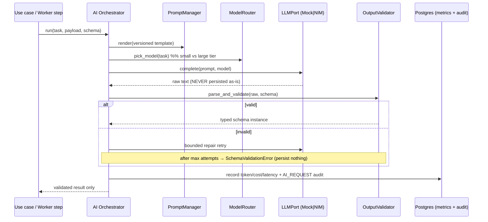
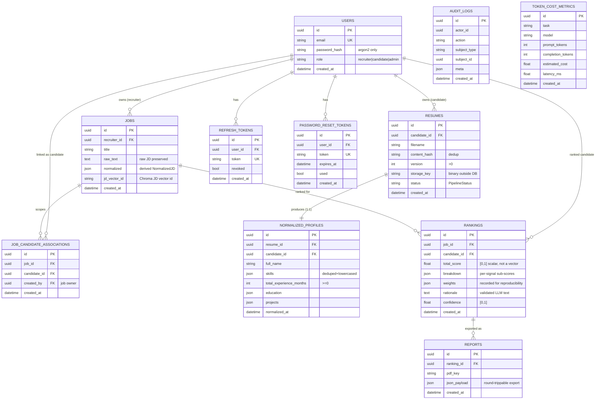
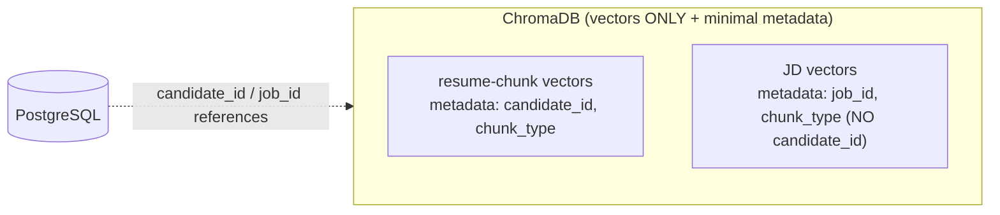

# AI Resume Screening Platform

Backend-first platform that ingests resumes and job descriptions, extracts and
normalizes structured candidate data, and ranks applicants against a JD with a
hybrid, explainable pipeline — plus AI analysis, comparison, duplicate
detection, interview-question generation, resume review/ATS optimization,
explainable ranking rationales, and exportable reports.

Every AI capability is coordinated through a single **AI Orchestrator**; no
endpoint or worker step calls a model directly. The system follows Clean
Architecture / DDD (`api → application → domain → infrastructure`). Structured
data lives in PostgreSQL; vectors live in ChromaDB; the two are never mixed.

## Architecture

```
api/             FastAPI routers, DI wiring, auth guards, error mapping
application/     use cases: AI Orchestrator, services, ranking, normalization, pipeline
domain/          framework-free entities, enums, ports (seams), errors
infrastructure/  adapters: mock/NIM LLM+embeddings, in-memory/Chroma vectors,
                 in-memory/SQLAlchemy repos, storage, security, Celery
```

Dependencies point inward. Infrastructure implements domain **ports**
(`LLMPort`, `EmbeddingPort`, `VectorPort`, `RepoPort`, `StoragePort`), so
adapters are swappable (mock ↔ NIM, in-memory ↔ Postgres/Chroma) with no change
to inner layers.

## High-Level Design (HLD)



**Invariant:** arrows from `api`/`application` reach infrastructure **only through ports**. `LLMPort`/`EmbeddingPort` have paired mock + NIM implementations selected by config; Offline_Mode binds the mocks so the whole system boots key-less.

## AI request flow (every AI call goes through the orchestrator)



## Automatic ingestion chain (stops at EMBEDDED)

```mermaid
stateDiagram-v2
    [*] --> UPLOADED
    UPLOADED --> PARSED: parse (pdf/docx text)
    PARSED --> NORMALIZED: extract → validate → normalize (atomic; profile persisted)
    NORMALIZED --> EMBEDDED: chunk → embed → store vectors (verify)
    EMBEDDED --> [*]: automatic chain COMPLETE

    UPLOADED --> FAILED: corrupt/empty/unsupported
    PARSED --> FAILED
    NORMALIZED --> FAILED: vector upsert retries exhausted

    note right of EMBEDDED
        ANALYZED / RANKED / REPORTED are reached ONLY by
        on-demand, recruiter-triggered operations — never
        by the automatic chain.
    end note
```



## Database / ER model (PostgreSQL — structured source of truth)

Vectors are **never** stored here; they live only in ChromaDB with metadata keys
restricted to a subset of `{candidate_id, job_id, chunk_type}`.



## Vector store (ChromaDB — vectors only)




### Storage boundary
- **PostgreSQL**: profiles, scores, rationales, audit, associations, metrics.
- **ChromaDB**: vectors only + minimal metadata — a subset of
  `{candidate_id, job_id, chunk_type}` (JD vectors carry `{job_id, chunk_type}`).

### Pipeline
The automatic upload chain (Celery over Redis) advances only through
`EMBEDDED`: Upload → Parse → Validate → Normalize → Chunk → Embed → Store.
**Analyze / Rank / Report are on-demand**, recruiter-triggered against a chosen
job, and operate only over that job's associated candidates.

## Web UI (React + TypeScript + Vite)

A production-quality SaaS frontend lives in `frontend/` (React 18 + TypeScript +
Vite, React Router). It's an ATS-style app with a sidebar, dashboard, jobs &
candidate management, resume upload with a live pipeline stepper
(Uploaded → Parsed → Normalized → Embedded → Analyzed → Ranked → Report Ready),
ranking table, analysis, comparison, interview questions, resume/ATS review,
report viewer, settings, and profile — with **dark mode**,
responsive layout, loading skeletons, empty/error states, toasts, confirm
dialogs, and **searchable dropdowns instead of UUID inputs**.

The app is **built to static assets and served by FastAPI at `/`** (single
service — no separate frontend host needed). In development it runs on the Vite
dev server and proxies API calls to the backend.

```bash
# Dev (hot reload): backend on :8000, frontend on :5173
uvicorn api.app:app --reload
cd frontend && npm install && npm run dev

# Production build (served by FastAPI at /)
cd frontend && npm run build      # emits frontend/dist
```

Docs: see `docs/ARCHITECTURE.md`, `docs/API.md`, `docs/DEPLOYMENT.md`,
`docs/DEVELOPER.md`, `docs/TROUBLESHOOTING.md`.

## Offline_Mode (no NVIDIA key)

Set `AI_MODE=offline` (the default) — or simply omit `NVIDIA_API_KEY` — to bind
the paired deterministic mock LLM + embedding adapters. The whole system boots
and the full test suite passes with **no key and no external services**.

```bash
pip install -e ".[dev]"        # or: pip install pydantic fastapi hypothesis pytest ...
pytest                         # full suite, Offline_Mode, coverage gate >= 80%
uvicorn api.app:app --reload   # Swagger at http://localhost:8000/docs
```

## Local Docker stack

```bash
cp .env.example .env
docker compose up               # api + worker + postgres + redis + chroma
```

## Online deployment (free tier, no GPU)

Same image, env-only difference. AI is the hosted **NVIDIA NIM** API.

- **Fly.io**: `fly deploy` (uses `fly.toml`; `alembic upgrade head` runs on release).
- **Render**: connect the repo (uses `render.yaml`; migrations via `preDeployCommand`).
- **Railway**: uses `railway.json` (Dockerfile build; migrations run in `startCommand`).
- **Datastores**: Neon/Supabase (Postgres), Upstash (Redis), Chroma Cloud (vectors).

### NVIDIA NIM key setup
1. Get a free developer key at `build.nvidia.com`.
2. Set it as a secret (never commit it):
   - Fly: `fly secrets set NVIDIA_API_KEY=... JWT_SECRET=...`
   - Render: set `NVIDIA_API_KEY` (and other secrets) in the dashboard.
3. Set `AI_MODE=online`. Verify model ids in `MODEL_SMALL` / `MODEL_LARGE` /
   `EMBEDDING_MODEL` against `build.nvidia.com`.

The only difference between local and online is environment variables (Req 31.1/31.2).

## Admin provisioning

Admins are never created via public registration (Req 1.8):

```bash
python seed.py admin admin@example.com "a-strong-password"
```

## Quality gates (CI)

GitHub Actions runs Ruff, Black, mypy, and pytest in Offline_Mode, failing the
build on any issue or if coverage is below the threshold (see
`.github/workflows/ci.yml`).

## Requirements & design traceability

Implementation follows `.kiro/specs/ai-resume-screening-platform/`
(`requirements.md`, `design.md`, `tasks.md`). Correctness properties 1–11 plus
the report JSON round-trip are covered by `hypothesis` property tests in
`tests/`.
